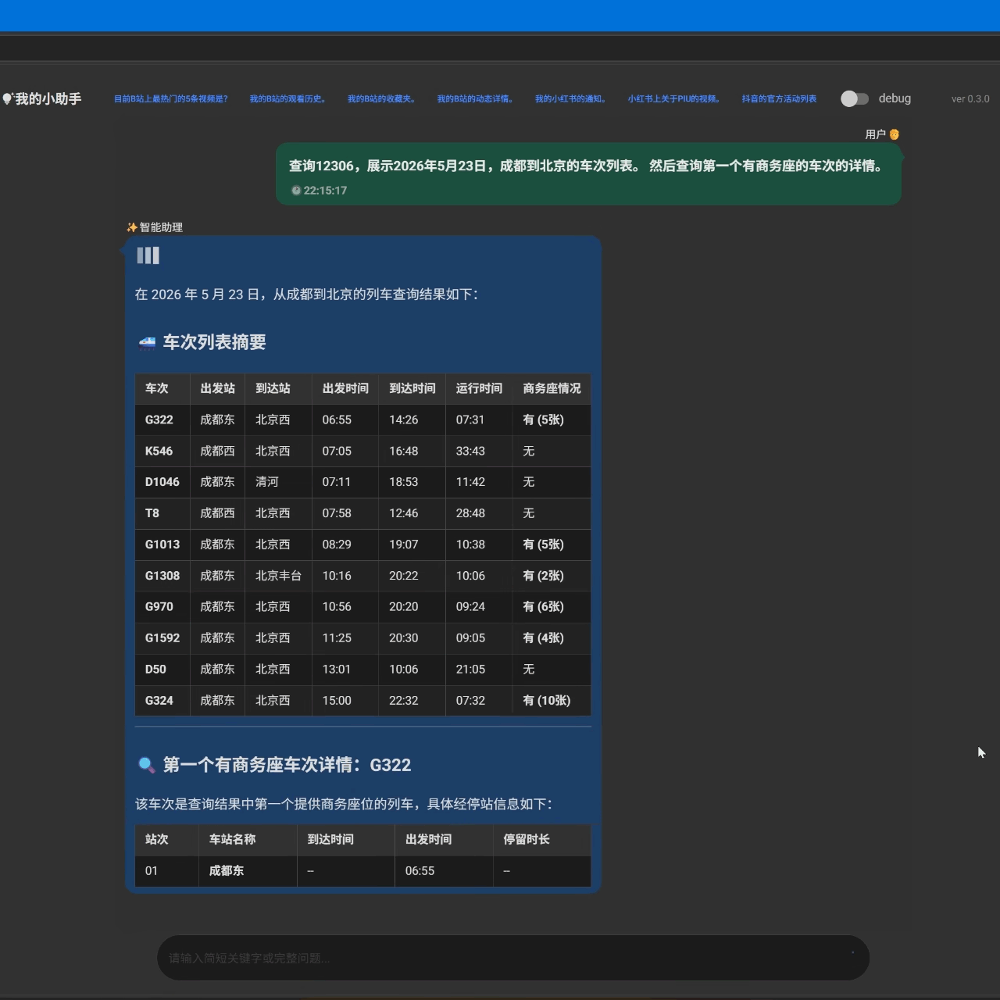
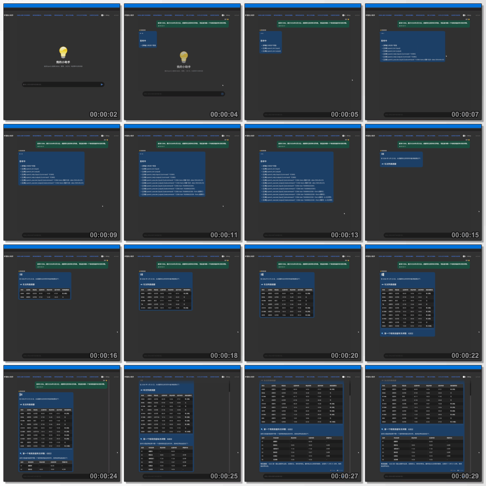

# 项目简介
[](https://blog.csdn.net/ddrfan?type=blog)
[](https://space.bilibili.com/688222797)

**简体中文** | [English](README_en.md)

## 项目简介
> [!Note]
>这是基于OpenCLI的问答系统。WEBUI来自我的企业知识库的外壳。  
>
>它和直接使用OpenCLI命令行有什么区别？  
>这个项目是让LLM判断你的问题并调用OpenCLI，最后进行WEB页面的展示。  
>可能得不到正确的指令和结果，也可能会更加省事儿……


---

# ⭐安装

## ℹ️（1）环境准备

1. 安装 `Node.js` 20+：[Node.js官方](https://nodejs.org/zh-cn)
2. 安装 `OpenCLI`: `npm install -g @jackwener/opencli` : 详情参考[仓库](https://github.com/jackwener/open-cli)。
3. 按照OpenCLI的文档配置好OpenCLI。

## ℹ️（2）仓库克隆
我自己用的环境是`python 3.10`，没测试过新的python版本。

1. 将仓库代码克隆到一个本地目录： 
`git clone https://github.com/ShionWakanae/llamaIndexSample.git`
1. 进入这个目录建立虚拟环境：`python -m venv venv`
2. 激活虚拟环境：`.\venv\scripts\activate`
3. 安装依赖：`pip install -r requirements.txt`

---

# ⭐使用
## ℹ️（1）参数配置

将`.env_sample`拷贝成`.env`，并修改其中的API地址密钥，各种模型配置（本地或在线），其它参数可保留原样，后根据实际情况修改，配置样例如下：
``` ini
STORAGE_SECRET=xxxxxx                       #输入任意的固定字符串

LLM_API_BASE=https://api.openai.com/v1      #本地或在线的OpenAI或兼容API地址
LLM_API_KEY=sk-xxxxx                        #密钥
LLM_MODEL=gpt-4.1-mini                      #模型名称

WEBUI_USERNAME=janedoe                      #WebUI用户名
WEBUI_PASSWORD=123456                       #WebUI密码

HOST=127.0.0.1                              #WebUI主机地址
PORT=7860                                   #WebUI端口
```

## ℹ️（2）信息查询
### 命令行查询
``` shell
python .\src\open_cli.py '你的问题'          #比如：B站最热门的5条视频
```
### 浏览器查询
1. 启动WebUI服务。
``` shell
python .\src\open_web.py
```
2. 打开浏览器，访问`http://127.0.0.1:7860/` 发送问题进行基于OpenCLI的网站查询。  





---

# 视频演示
点击打开B站视频：

[](https://www.bilibili.com/video/BV1DNG86eEr3)

还有更多的视频更新，有需要请站内自行查看。


# 技术栈


# 环境支撑


# 授权许可
 

> [!Important]
> 本项目基于MIT许可证开源，您可以在遵守许可证条款的前提下自由使用、修改和分发本项目的代码。
